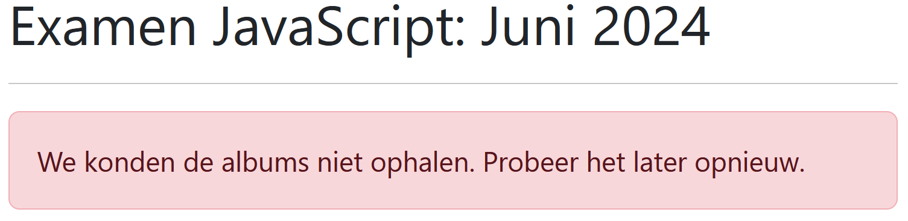
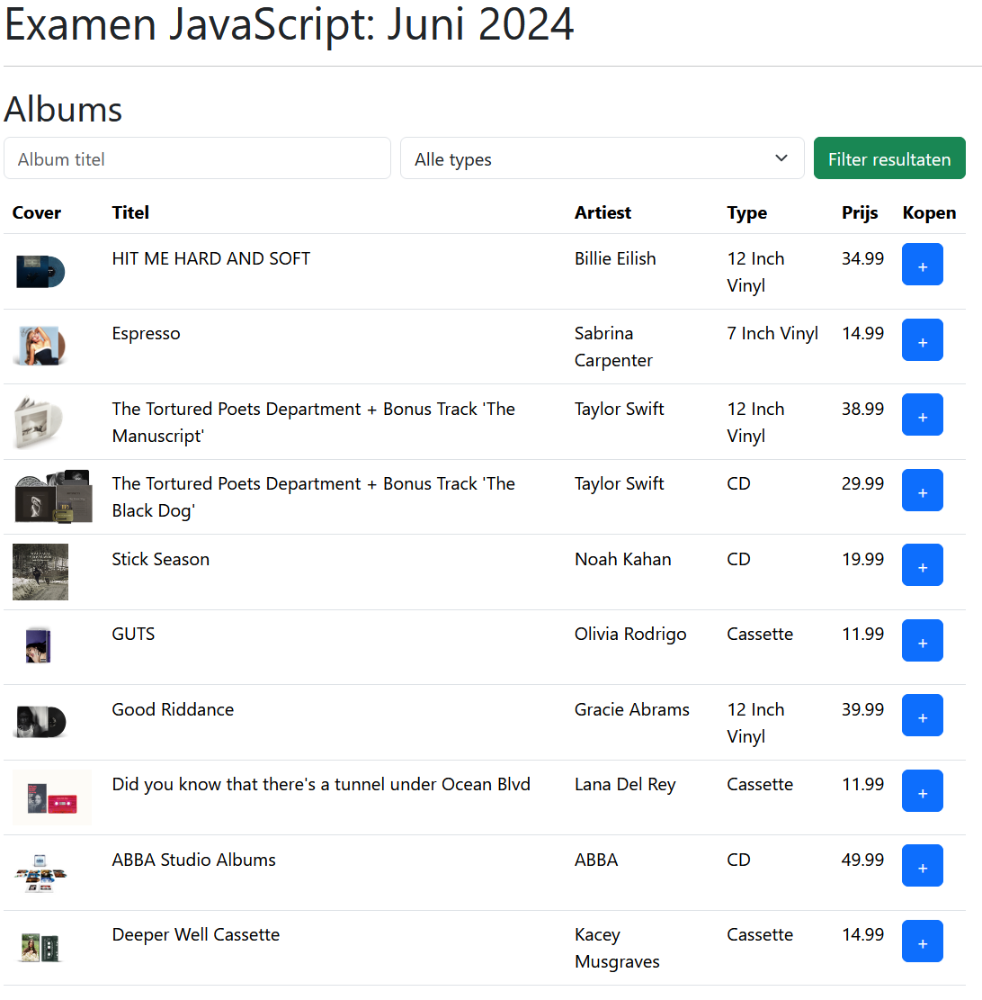
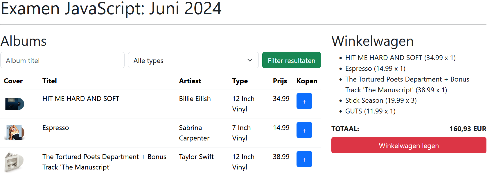
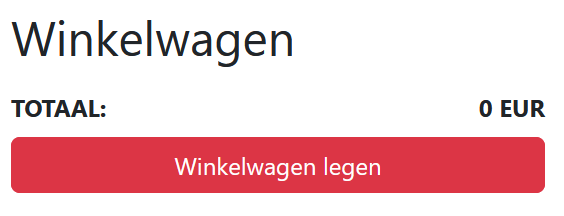
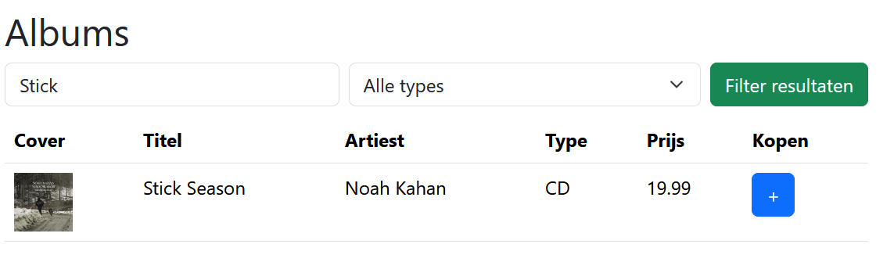
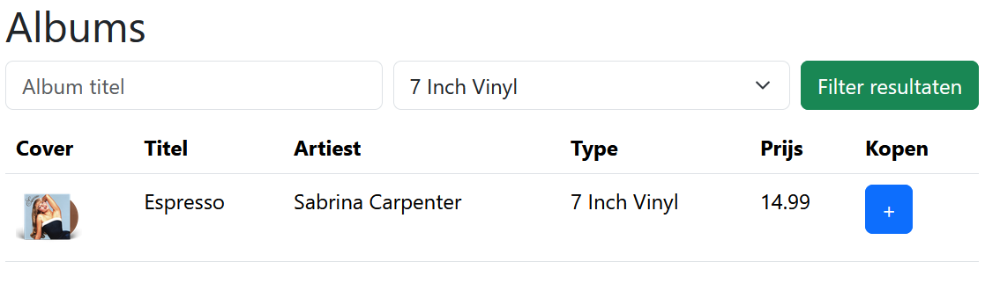
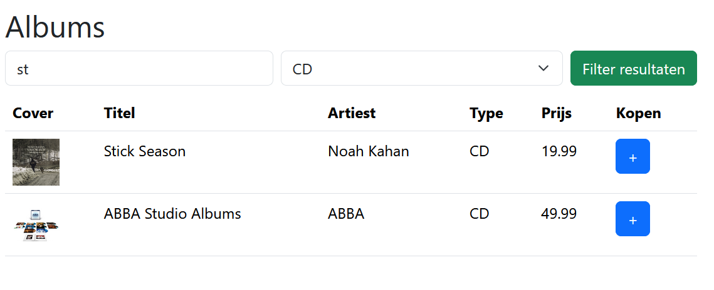

# Aanvang van het examen

Download startbestanden.zip van het Canvas examen.

Open het HTML-bestand **via de live server plug-in in Visual Studio Code**.
Dit is cruciaal, als je live server niet gebruikt kan je de nodige data niet inladen.

Tijdens dit examen bouw je een pagina waarop een overzicht van verschillende fysieke muziek releases te vinden zijn die
toegevoegd kunnen worden aan een winkelmand.

**Je wordt niet beoordeeld op de opmaak (lay-out) van je code.
Als deze niet 100% overeenkomt met de screenshots is dit dus geen probleem.
Je wordt enkel beoordeeld op de functionaliteit.**

## Albums inladen (3 punten)

Schrijf een **asynchrone** functie fetchData waarmee je via fetch het JSON-bestand _music.json_ inlaad.
Dit bestand is te vinden in de startbestanden in de /data map.
Roep de functie op zodra de applicatie geopend wordt.

In het geval de data succesvol ingeladen wordt plaatst je de data in een **globale** variabele.
In het geval de data niet succesvol ingeladen wordt, bijvoorbeeld door een typo in de URL, moet de foutmelding die in de
startbestanden te vinden is zichtbaar gemaakt worden.
Dit kan door de CSS-klasse _d-none_ te verwijderen.

## Albums renderen (4 punten)

De ingeladen albums moeten toegevoegd worden aan de HTML-pagina.
Maak hiervoor een nieuwe functie _renderAlbums_ die opgeroepen wordt zodra de promise _fetchData_ resolved is.

**In het geval dat je de fetchData functie niet hebt kunnen implementeren, kan je de array albums gebruiken die in de
startbestanden terug te vinden is onder _/data/albums.js_.
Je krijgt dan natuurlijk wel een 0 op de _fetchData_ functie.**

Gebruik in de renderAlbum functie bij voorkeur DOM-manipulatiefuncties en één of meerdere lussen om de tabel op te
vullen, voor lange HTML-strings als:

`table.innerHTML = '<tr><td>...</td></tr>';`

krijg je minder punten.
Om de opmaak van onderstaand screenshot volledig na te bouwen, kan je de CSS-klassen _btn_ en _btn-primary_ toevoegen
aan de knop.

## Winkelwagen

Gebruikers kunnen een album selecteren en dit één of meer keer toevoegen aan het winkelmandje.

### Initialisatie & constructor (1 punt)

Schrijf een nieuwe **klasse** _ShoppingCart_.
Voorzie een constructor waarin je de instantievariabele _items_ initialiseert als een leeg object.
Voeg vervolgens drie methodes _addAlbum_, _renderItems_ en _emptyCart_ toe.

### addAlbum (3 punten)

De _addAlbum_ methode krijgt de gegevens van een album (minimaal _id_, _naam_ en _prijs_) als parameter.
Als het album al in het winkelmandje zit wordt het aantal verhoogt, als het album nog niet in het winkelmandje zit wordt
het toegevoegd.
Tenslotte moet de _renderItems_ methode opgeroepen worden.

Koppel deze methode tenslotte aan de '+' knop in de tabel met albums.

### renderItems (4 punten)

Deze methode plaatst de inhoud van het winkelmandje op de webpagina.
Elk list-item bestaat uit de naam van het album, de prijs en het aantal keer dat dit item in het winkelmandje zit.

Daarnaast moet ook de totaalprijs geüpdatet worden, zorg ervoor dat deze afgerond is tot op twee cijfers na de komma.

Aangezien deze methode verschillende keren opgeroepen wordt, moet het winkelmandje ook terug leeg gemaakt worden.
Maak gebruik van de **querySelectorAll** methode om de listitems te verwijderen aan het begin van de methode.

### emptyCart (2 punt)

Deze methode maakt de winkelwagen leeg en moet opgeroepen worden als op de knop "Winkelwagen legen" gedrukt wordt.

## Albums filteren

Bovenaan de albums pagina zijn een tekst input element en een select beschikbaar waarmee de albums gefilterd kunnen
worden.

Zorg ervoor dat de gebruiker de albums kan filteren op naam, op type of op allebei samen.
De resultaten worden gefilterd zodra de gebruiker op de knop "filter resultaten" drukt.
Voor de naam input moet gezocht worden naar een **substring** in de titel van het album en moet het dit
**case-insensitive** gebeuren.

### Titel (0.5 punt)

### Type (0.5 punt)

### Beide (2 punten)

